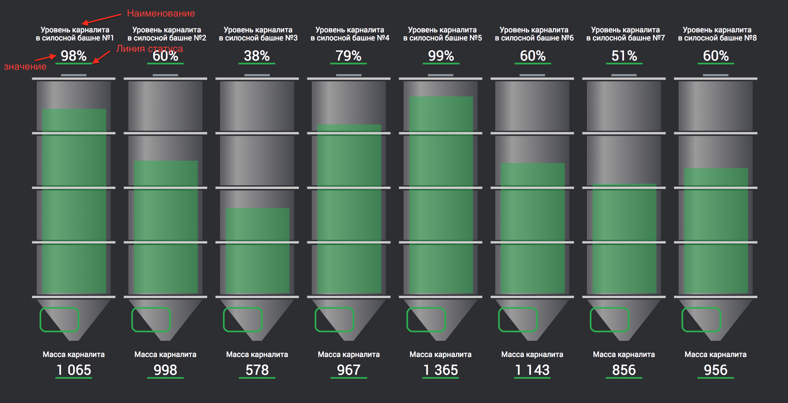

# SiloTowers

##С API приходят 2 типа индикатора для каждой башни: масса и уровень.
_Модель индикатора:_
`class Indicator {
     public id: string;
     public title: string;
     public value: number;
     public minValue: number;
     public maxValue: number;
}`
Предоставить пользователю возможность выполнять CRUD операции с индикаторами. 

Format: 

https://docs.microsoft.com/ru-ru/dotnet/architecture/microservices/multi-container-microservice-net-applications/data-driven-crud-microservice
[Архитектура микросервисов](https://docs.microsoft.com/ru-ru/dotnet/architecture/microservices)